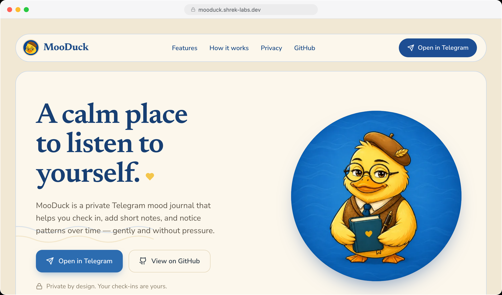

# Mooduck



Mooduck is a small mood journal: you log how you feel on a 1–10 scale, optionally add a short note, and review your history. It lives entirely in a **Telegram bot**; the backend stores a **hashed Telegram user id**, not a user profile, and encrypts everything you write.

The repo is a **pnpm** + **Turborepo** monorepo.

> **No web app right now.** There used to be a React SPA and an HTTP API behind it; both were removed, and a web client will be written from scratch later. The server today serves exactly two routes: the Telegram webhook and `/health`.

## Repository layout

| Path | Role |
|------|------|
| `apps/landing` | **mooduck-landing** — React 19 + Next.js (App Router) marketing site, Tailwind CSS v4 + CSS Modules; built as a static export (`out/`) served by nginx |
| `apps/server` | **mooduck-server** — the Telegram bot: Express (webhook only), Drizzle ORM, SQLite (Turso in production or a local file in dev) |
| `packages/core` | Shared non-UI utilities (`Null`, `Number`, `Random`, …) |

## Prerequisites

- [Node.js](https://nodejs.org/) (CI uses 22; match or exceed that locally)
- [pnpm](https://pnpm.io/) **9.x** or newer (`package.json` pins the workspace package manager)

## Install

```sh
pnpm install
```

## Environment

Server configuration is validated in `apps/server/src/common/config/environment.ts` (see also `apps/server/docs/env.md`). At minimum you need:

- **`TELEGRAM_USER_ID_SECURE_HASH`** — secret the user identity hash is derived from
- **`TELEGRAM_USER_DATA_ENCRYPTION_SECRET`** — secret that encrypts mood comments and chat messages at rest. Must differ from the one above, and rotating it makes existing data undecryptable
- **Database** — either Turso (`TURSO_CONNECTION_URL`, `TURSO_AUTH_TOKEN`) or, in dev only, `USE_LOCAL_DB=true` with optional `LOCAL_DB_PATH` (defaults to `data/local.db` under the server app)

Optional but used when you enable those features:

- **Telegram** — `TELEGRAM_BOT_TOKEN` plus the webhook settings (without a token the bot simply doesn't start)
- **DeepSeek** — `DEEPSEEK_API_TOKEN` for AI-assisted replies

Copy or create `.env` under `apps/server` as you normally would for local work.

## Common scripts (repo root)

| Script | What it does |
|--------|----------------|
| `pnpm dev` | Runs Turborepo `dev` (server + landing and related packages, with `MODE=dev`) |
| `pnpm dev.landing` | Dev for the Next.js landing site only (`http://localhost:3002`) |
| `pnpm dev.server` | Dev for the bot server only |
| `pnpm dev.local` | Server dev with **`USE_LOCAL_DB=true`** (local SQLite file) |
| `pnpm build` | Production build (`MODE=prod`) |
| `pnpm typecheck` | Typecheck across the workspace |
| `pnpm test` | Tests (where configured; server uses Vitest) |
| `pnpm db.push.local` / `pnpm db.migrate.local` / `pnpm db.studio.local` | Drizzle against the local DB (dev + `USE_LOCAL_DB`) |
| `pnpm db.push` / `pnpm db.migrate` / `pnpm db.studio` | Drizzle against configured remote DB |

Package-specific scripts (lint, `test.watch`, etc.) live in each `package.json`.

## Production process

- **`pnpm start`** — Turborepo `start` for production-oriented entrypoints.
- **`pnpm start.server`** — Run the built server bundle only.
- **`pnpm pm2.start`** / **`pnpm pm2.restart`** — PM2 helpers using `ecosystem.config.js`.

CI (`.github/workflows/deploy.yml`) installs with a frozen lockfile, runs `pnpm run codecheck` (typecheck + placeholder lint), then deploys to a VPS via SSH and `./deploy.sh` on the host.

## Tech stack (short)

- **Web:** Vite, React 19, TypeScript, Zod  
- **Server:** Express, Drizzle + libSQL/Turso, Zod, Winston, optional `node-telegram-bot-api` and OpenAI-compatible client for DeepSeek  
- **Repo:** Turborepo, Prettier at the root

---

Internal conventions (types vs interfaces, no barrel re-exports, module layout) are documented in `.cursorrules` for contributors.
